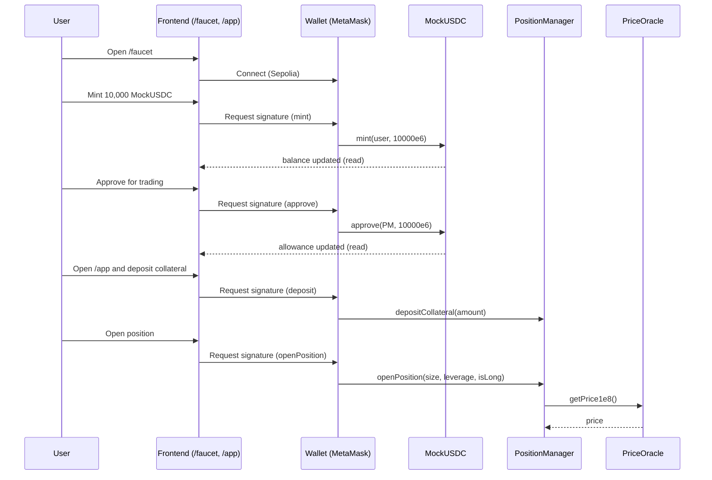

# CipherPerps

CipherPerps is a **Sepolia demo** of a perpetuals-style trading app with a simple onchain MVP and a modern Next.js frontend.

- **Frontend**: Next.js App Router + TypeScript + Tailwind CSS + wagmi/viem + RainbowKit
- **Contracts**: Foundry (Solidity) MVP modules (PositionManager, TradingEngine, PriceOracle, LiquidationEngine) + `MockUSDC`
- **Current demo flow**: `/faucet` → mint MockUSDC → approve → `/app` → deposit collateral → open/close a position

## Repo structure

- **`frontend/`**: Next.js app (UI, wallet connect, faucet, app screens)
- **`contracts/`**: Foundry workspace (Solidity contracts, scripts, tests)

## Architecture (high level)

```mermaid
flowchart TB
  subgraph User
    U[Trader]
    MM[MetaMask / Wallet]
  end

  subgraph Frontend[Next.js frontend]
    UI[UI صفحات\n/  /faucet  /app]
    W[wagmi + viem\n(read/write contracts)]
    RK[RainbowKit\nConnectButton]
    CFG[Contract addresses + ABIs\nfrontend/lib/contracts.ts]
  end

  subgraph Sepolia[Sepolia network]
    USDC[MockUSDC (ERC20, 6 decimals)]
    PM[PositionManager]
    TE[TradingEngine]
    ORA[PriceOracle]
    LE[LiquidationEngine]
    CL[(Chainlink ETH/USD feed)]
  end

  U --> UI
  UI --> RK --> MM
  UI --> W
  CFG --> W

  W <--> USDC
  W <--> PM
  PM --> TE
  PM --> ORA --> CL
  PM --> LE
```

## Onchain modules (MVP)

The contract layout (under `contracts/src/`) is intentionally minimal for a demo:

- **`MockUSDC.sol`**: 6-decimal ERC20 used as test collateral. Includes a `mint(to, amount)` faucet-style function.
- **`PositionManager.sol`**: user collateral + per-user position storage (currently 1 position per user).
- **`TradingEngine.sol`**: simplified PnL math placeholder (demo logic).
- **`PriceOracle.sol`**: Chainlink adapter returning ETH price normalized to `1e8`.
- **`LiquidationEngine.sol`**: liquidation gate + entrypoint (maintenance-margin style checks).
- **`fhe/FheTypes.sol`**: placeholder types for future Zama FHE integration.

## Frontend pages

- **`/`**: landing
- **`/faucet`**: mint **10,000** MockUSDC to your connected wallet and approve the `PositionManager`
- **`/app`**: deposit collateral and interact with the protocol

## Local development

### Prerequisites

- **Node.js**: \(>= 20\) recommended.  
  Note: some dependencies may print engine warnings on slightly older Node 20 minors. If you see engine warnings, upgrade to the latest Node 20 LTS (or Node 22).
- **npm**: comes with Node
- **Foundry** (for contracts): `forge`, `cast`, `anvil`

### 1) Frontend setup (Next.js)

```bash
cd frontend
npm install
npm run dev
```

Then open `http://localhost:3000`.

### 2) Contracts setup (Foundry)

Install Foundry (if needed):

```bash
curl -L https://foundry.paradigm.xyz | bash
foundryup
```

Build and test:

```bash
cd contracts
forge build
forge test
```

## Deploying contracts to Sepolia

### Environment

`contracts/.env` is used for deployment configuration.

- **Do not commit real private keys**. Use a fresh dev key or a dedicated test wallet.

Typical variables:

- **`PRIVATE_KEY`**: deployer private key
- **`SEPOLIA_RPC_URL`**: Sepolia RPC endpoint
- **`CHAINLINK_FEED`**: Chainlink ETH/USD feed address on Sepolia
- **`ETHERSCAN_API_KEY`**: optional for verification later

### Deploy script

Deployment script lives in:

- **`contracts/script/DeployCipherPerps.s.sol`**

Run (example):

```bash
cd contracts
source .env

forge script script/DeployCipherPerps.s.sol:DeployCipherPerps \
  --rpc-url "$SEPOLIA_RPC_URL" \
  --private-key "$PRIVATE_KEY" \
  --broadcast
```

After deploying, update the frontend addresses in:

- **`frontend/lib/contracts.ts`**

This file is the source of truth for the Sepolia addresses used by `/faucet` and `/app`.

## End-to-end user flow

### Faucet → approve → deposit → trade



## MetaMask tip (MockUSDC)

Mock tokens don’t automatically show in MetaMask. To see your minted balance:

- Switch to **Sepolia**
- **Assets → Import tokens**
- Paste the **MockUSDC contract address** from the faucet page
- Token details: **symbol `mUSDC`**, **decimals `6`**

## Troubleshooting

- **Build fails due to optional deps**: this project stubs a couple optional packages in `frontend/next.config.mjs` so RainbowKit/wagmi build reliably in Next.js.
- **Wrong network**: the demo is wired for **Sepolia**. Switch your wallet network.
- **No balance in wallet UI**: import the token contract into MetaMask (see tip above).

## Security / production notes

This is a demo MVP:

- Contracts are simplified and **not audited**
- `MockUSDC` is a test token with a public mint
- Trading math and liquidation checks are intentionally minimal

If you want to productionize this, start with a full spec, invariants, and an audit-grade test suite.

