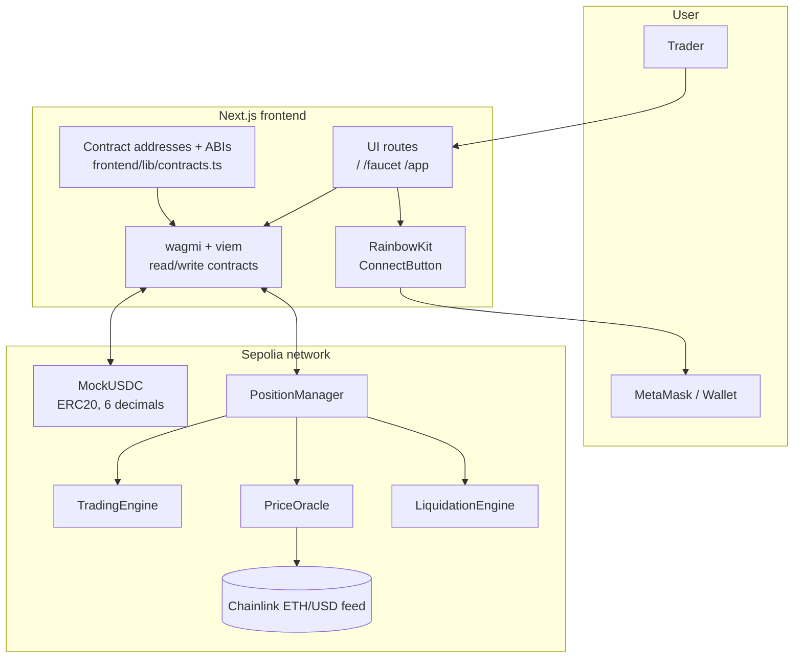
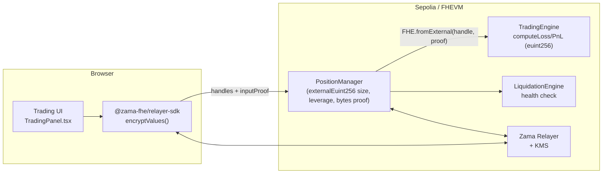
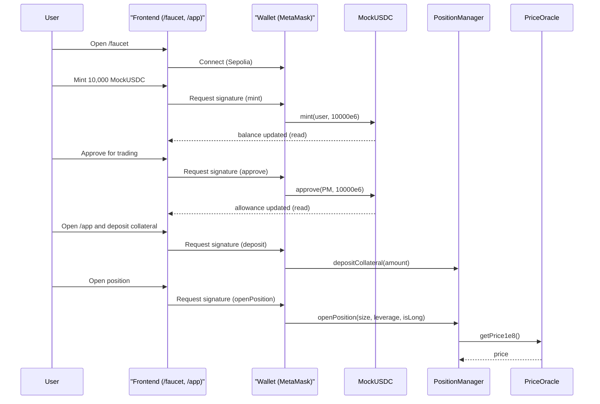

# CipherPerps

CipherPerps is a **Sepolia demo** of a perpetuals-style trading app with a simple onchain MVP, a Zama-FHE-ready architecture, and a modern Next.js frontend.

- **Frontend**: Next.js App Router + TypeScript + Tailwind CSS + wagmi/viem + RainbowKit
- **Contracts**: Foundry (Solidity) MVP modules (PositionManager, TradingEngine, PriceOracle, LiquidationEngine) + `MockUSDC`
- **Zama FHE-ready**: contracts type position size & leverage as `euint256` (placeholder today, real FHEVM next), and the frontend already wires the **Zama Relayer SDK** for encrypted-input building.
- **Current demo flow**: `/faucet` → mint MockUSDC → approve → `/app` → deposit collateral → open/close a position

## Repo structure

- **`frontend/`**: Next.js app (UI, wallet connect, faucet, app screens)
- **`contracts/`**: Foundry workspace (Solidity contracts, scripts, tests)

## Architecture (high level)



## Onchain modules (MVP)

The contract layout (under `contracts/src/`) is intentionally minimal for a demo:

- **`MockUSDC.sol`**: 6-decimal ERC20 used as test collateral. Includes a `mint(to, amount)` faucet-style function.
- **`PositionManager.sol`**: user collateral + per-user position storage (currently 1 position per user).
- **`TradingEngine.sol`**: simplified PnL math placeholder (demo logic).
- **`PriceOracle.sol`**: Chainlink adapter returning ETH price normalized to `1e8`.
- **`LiquidationEngine.sol`**: liquidation gate + entrypoint (maintenance-margin style checks).
- **`fhe/FheTypes.sol`**: defines a placeholder **`euint256`** user-defined type (and `FheUint256` wrap/unwrap library). This lets `PositionManager`, `TradingEngine`, and `LiquidationEngine` already use `euint256` in their public API and storage so the swap to real Zama FHEVM types is a localized change.

## Zama FHE integration

CipherPerps is structured to graduate from a plaintext MVP to a confidential perpetuals dApp powered by **Zama FHEVM**.

What this means in practice today:

- **Contracts (FHE-shaped API, plaintext math for now)**
  - `contracts/src/fhe/FheTypes.sol` defines a placeholder `euint256` user-defined value type.
  - `PositionManager.openPosition(euint256 size, euint256 leverage, bool isLong)` already takes `euint256` for sensitive trader inputs.
  - `TradingEngine` exposes `computeLoss` and `computePnl` returning `euint256`, so loss/PnL stay encrypted-by-type.
  - `LiquidationEngine` operates over an `euint256`-typed position payload and a price-based health check.
  - The math is currently plaintext (`uint256` underneath), so onchain logic is identical to a non-FHE MVP — but the **types and function signatures are already “FHE-correct”**.
- **Frontend (Zama Relayer SDK wired)**
  - `frontend/package.json` depends on `@zama-fhe/relayer-sdk`.
  - `frontend/lib/encryption.ts` initializes the SDK (`initSDK`, `createInstance`, `SepoliaConfig`) and builds **encrypted inputs** with `instance.createEncryptedInput(...).add256(value).encrypt()` to produce **ciphertext handles + an input proof** ready for FHEVM contracts.
  - `frontend/components/TradingPanel.tsx` and `PositionCard.tsx` reference this module and document that the next Solidity iteration will accept `externalEuint*` + `bytes proof` on `openPosition`, then import them onchain via `FHE.fromExternal(handle, proof)`.

What is intentionally **not** done in this MVP (so it’s clear):

- The deployed Sepolia contracts do **not** yet take `externalEuint*` + `bytes proof` parameters; they accept the placeholder `euint256` (a `uint256` wrapper).
- The frontend currently calls `openPosition` with placeholder values. The encryption module is plumbed in but not yet used on the live tx path.
- User-decryption flows (reading encrypted state back) are stubbed in `lib/encryption.ts` as a follow-up.

### FHE flow (target architecture)



### Migration checklist (MVP → FHE)

- Replace `euint256` in `contracts/src/fhe/FheTypes.sol` with **real Zama FHEVM types** (`@fhevm/solidity` imports, `FHE.*` helpers).
- Update `PositionManager.openPosition` (and any input-taking entrypoints) to accept `externalEuint256 size, externalEuint256 leverage, bytes proof`, then call `FHE.fromExternal(handle, proof)`.
- Switch `TradingEngine` math to FHE ops (`FHE.sub`, `FHE.mul`, `FHE.select`, etc.) and grant ACL access where needed (`FHE.allow`, `FHE.allowThis`).
- Wire `frontend/components/TradingPanel.tsx` to call `encryptValues({ contractAddress, userAddress, values })` from `lib/encryption.ts` and pass `handles[i]` + `inputProof` to `openPosition`.
- Implement user-decryption in `lib/encryption.ts` against the relayer for reading encrypted PnL/positions back into the UI.

## Frontend pages

- **`/`**: landing
- **`/faucet`**: mint **10,000** MockUSDC to your connected wallet and approve the `PositionManager`
- **`/app`**: deposit collateral and interact with the protocol

## Local development

### Prerequisites

- **Node.js**: \(>= 20\) recommended.  
  Note: some dependencies may print engine warnings on slightly older Node 20 minors. If you see engine warnings, upgrade to the latest Node 20 LTS (or Node 22).
- **npm**: comes with Node
- **Foundry** (for contracts): `forge`, `cast`, `anvil`

### 1) Frontend setup (Next.js)

```bash
cd frontend
npm install
npm run dev
```

Then open `http://localhost:3000`.

### 2) Contracts setup (Foundry)

Install Foundry (if needed):

```bash
curl -L https://foundry.paradigm.xyz | bash
foundryup
```

Build and test:

```bash
cd contracts
forge build
forge test
```

## Deploying contracts to Sepolia

### Environment

`contracts/.env` is used for deployment configuration.

- **Do not commit real private keys**. Use a fresh dev key or a dedicated test wallet.

Typical variables:

- **`PRIVATE_KEY`**: deployer private key
- **`SEPOLIA_RPC_URL`**: Sepolia RPC endpoint
- **`CHAINLINK_FEED`**: Chainlink ETH/USD feed address on Sepolia
- **`ETHERSCAN_API_KEY`**: optional for verification later

### Deploy script

Deployment script lives in:

- **`contracts/script/DeployCipherPerps.s.sol`**

Run (example):

```bash
cd contracts
source .env

forge script script/DeployCipherPerps.s.sol:DeployCipherPerps \
  --rpc-url "$SEPOLIA_RPC_URL" \
  --private-key "$PRIVATE_KEY" \
  --broadcast
```

After deploying, update the frontend addresses in:

- **`frontend/lib/contracts.ts`**

This file is the source of truth for the Sepolia addresses used by `/faucet` and `/app`.

## End-to-end user flow

### Faucet → approve → deposit → trade



## MetaMask tip (MockUSDC)

Mock tokens don’t automatically show in MetaMask. To see your minted balance:

- Switch to **Sepolia**
- **Assets → Import tokens**
- Paste the **MockUSDC contract address** from the faucet page
- Token details: **symbol `mUSDC`**, **decimals `6`**

## Troubleshooting

- **Build fails due to optional deps**: this project stubs a couple optional packages in `frontend/next.config.mjs` so RainbowKit/wagmi build reliably in Next.js.
- **Wrong network**: the demo is wired for **Sepolia**. Switch your wallet network.
- **No balance in wallet UI**: import the token contract into MetaMask (see tip above).

## Security / production notes

This is a demo MVP:

- Contracts are simplified and **not audited**
- `MockUSDC` is a test token with a public mint
- Trading math and liquidation checks are intentionally minimal

If you want to productionize this, start with a full spec, invariants, and an audit-grade test suite.

